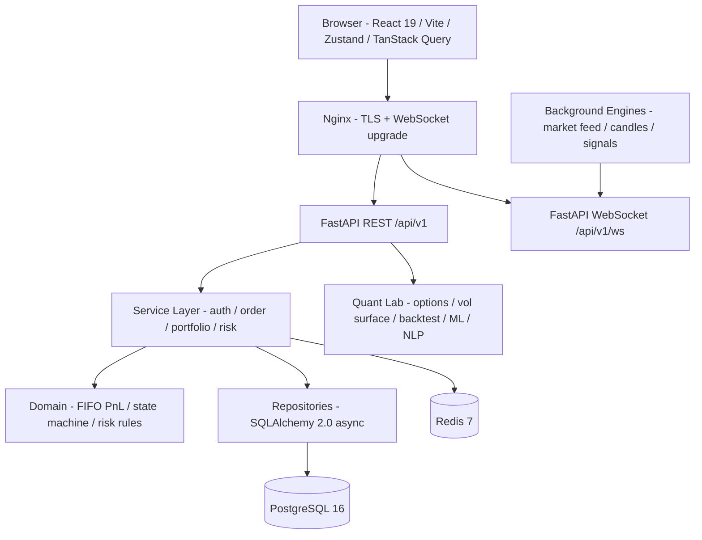

<div align="center">

# Algorithmic Trading Simulator

### *A production-grade quantitative trading platform — engineered like a trading firm ships, documented like a staff engineer reviews.*

<br/>

[](./.github/workflows/ci-cd.yml)
[](https://www.python.org/)
[](https://fastapi.tiangolo.com/)
[](https://react.dev/)
[](https://www.postgresql.org/)
[](https://redis.io/)
[](./LICENSE)
[](https://docs.astral.sh/ruff/)

<br/>

**[Architecture](./ARCHITECTURE.md)** · **[Audit](./AUDIT.md)** · **[Roadmap](./ROADMAP.md)** · **[API Docs](http://localhost:8000/docs)** *(once running)*

<br/>

</div>

---

## The 30-second version

This is **not** another React-and-Express to-do app dressed up as a trading dashboard.

It is a full-stack **quantitative trading terminal** built on the same architectural principles you'd find at a real trading desk — a **layered async backend**, **idempotent order execution**, **FIFO PnL accounting**, **factor-driven signals**, **refresh-token rotation in Redis**, and a frontend split between **Zustand** (client state) and **TanStack Query** (server state) with a **WebSocket → Query invalidation bridge**.

On top of that platform sits a **Quantitative Research Lab**: six self-contained quant modules — option pricing, a 3D volatility surface and its forecaster, a strategy backtester, a machine-learning return predictor, and an earnings-call sentiment analyzer — each backed by genuine, from-scratch numerical code (no black-box library hand-waving) and a purpose-built, interactive visualization.

> **Why it matters:** anyone can stack technologies. Few can defend the choices *and* implement the mathematics behind them. This project is built to be defended — line by line, equation by equation.

---

## Try it in 60 seconds

```bash
git clone https://github.com/Akshatx-io/Algorithmic-Trading-Simulator.git
cd Algorithmic-Trading-Simulator
cp .env.example .env
docker compose up                     # full stack: postgres · redis · api · frontend
```

**Local dev (no Docker):**

```bash
# backend
uvicorn main:app --reload --port 8000
# frontend
cd frontend && npm install && npm run dev
```

Then visit:

| Surface | URL | What you'll see |
|---|---|---|
| **Trading terminal** | <http://localhost:5173> | The app — register, log in, trade, explore the Quant Lab |
| **OpenAPI explorer** | <http://localhost:8000/docs> | Interactive Swagger UI for every endpoint |
| **Health probe** | <http://localhost:8000/health> | JSON status + DB connectivity |

Register → log in → place a trade → watch the portfolio update live over WebSocket → open the Quant Lab.

---

## ⚡ Quantitative Research Lab

The differentiator. Six modules, each a complete vertical slice — a numerically-honest engine, a typed API, and a bespoke, buttery visualization. Every metric on every screen has an inline ⓘ deep-dive explaining the math.

| Module | What it does | The mathematics under the hood |
|---|---|---|
| **Monte Carlo Option Pricer** | Prices European options and renders the simulation *running*, path by path | Risk-neutral **GBM** simulation, antithetic variance, **Black-Scholes** closed-form benchmark, full **Greeks** (Δ Γ ν Θ ρ), 95% confidence interval, terminal-price distribution |
| **Neural Volatility Surface** | Interactive **3D implied-vol surface** across strikes × expiries (+ heatmap) | Parametric **SVI/SABR-style** smile → market-price grid → **Newton-Raphson IV inversion** at every node (round-trip error ≈ 1e-15) → C¹ smoothing fit |
| **Vol Surface Forecaster** | Forecasts how the surface evolves *N* days out with a confidence band | Surface decomposed into **level / skew / term** factors, each a mean-reverting **AR(1)/Ornstein-Uhlenbeck** process fit by least squares, analytic forecast variance |
| **Strategy Backtester** | Runs rule-based strategies vs buy-and-hold, lookahead-safe | SMA/EMA/RSI/momentum/Bollinger signals, transaction costs, **Sharpe · Sortino · Calmar**, max drawdown, profit factor, per-trade win rate |
| **Stock Return Predictor** | Predicts next-day returns and stress-tests the signal | **Random Forest written from scratch in NumPy** (bagging + random feature subsets + variance-reduction CART), feature pipeline, out-of-sample R²/IC/directional accuracy, **Monte Carlo bootstrap** equity fan |
| **Earnings-Call Sentiment** | Turns transcript text into a tradable signal | **Loughran-McDonald-style financial NLP** (negation flip + intensifiers) → **event-study backtest** (CAAR around the announcement, IC, hit rate, long-short *t*-statistic) |

**Engineering notes that make it credible:**

- The **3D surface and the Monte Carlo animation are pure `<canvas>` + `requestAnimationFrame`** — manual 3D→2D projection, painter's-algorithm depth sorting, per-quad Lambert shading, a perceptual colormap, and a clock-driven animation loop that auto-stops at convergence. **Zero 3D dependencies**, 60 fps.
- The **Random Forest and the IV solver are implemented from first principles in NumPy** — deterministic, dependency-free, and fast (sub-second). A HuggingFace transformer or scikit-learn estimator is a clean drop-in upgrade, not a crutch.
- Results are **honest**: daily returns show R² ≈ 0 and ~53% directional accuracy, the predictor often *loses* to buy-and-hold, and the sentiment signal is reported with a significance *t*-stat. That realism is the point.

---

## The methodology — *audit first, code second*

```
┌─────────────┐     ┌──────────────┐     ┌───────────┐     ┌───────────────┐
│   AUDIT     │────▶│ ARCHITECTURE │────▶│  ROADMAP  │────▶│ IMPLEMENTATION │
└─────────────┘     └──────────────┘     └───────────┘     └───────────────┘
  What's wrong        The target           When + how         Ship & defend
  in the codebase     system to be         we get there       every commit
```

| Document | What it contains |
|---|---|
| [`AUDIT.md`](./AUDIT.md) | Forensic teardown of the original codebase with **file:line references**, **severity ratings (P0–P3)**, and a **top-25 punchlist**. |
| [`ARCHITECTURE.md`](./ARCHITECTURE.md) | The target system: **folder layout**, **service boundaries**, **event flows**, **WebSocket protocol**, **trade-flow sequence diagram**, **ADR discipline**. |
| [`ROADMAP.md`](./ROADMAP.md) | Phased execution plan: **ordered tasks**, **acceptance criteria**, and **interview talking points** for every phase. |

This is the discipline that separates a portfolio project from a defensible engineering artifact.

---

## Architecture at a glance



The full sequence diagram for one complete trade — browser `POST` → idempotency check → transaction → event emit → WebSocket fan-out → TanStack Query invalidation — lives in [`ARCHITECTURE.md` §12](./ARCHITECTURE.md).

---

## Tech stack

<table>
<tr>
<td valign="top" width="33%">

### Backend

- **FastAPI** + Uvicorn (async ASGI)
- **SQLAlchemy 2.0** (async) + Alembic
- **PostgreSQL 16** primary store
- **Redis 7** cache · pub/sub · idempotency
- **NumPy** — all quant numerics
- **PyJWT** + **bcrypt**
- **Pydantic v2** validation
- **loguru** structured logging

</td>
<td valign="top" width="33%">

### Frontend

- **React 19** + **Vite 7**
- **TailwindCSS 3** + design tokens
- **Zustand 5** — client state
- **TanStack Query 5** — server state
- **Recharts** — analytics
- **Custom Canvas/rAF** — 3D surface & sims
- **lucide-react** — iconography
- **react-hot-toast** — notifications

</td>
<td valign="top" width="33%">

### Infra & Tooling

- **Docker** multi-stage builds
- **docker-compose** dev topology
- **GitHub Actions** CI
- **Ruff** lint + format
- **mypy** type checking
- **pytest** + pytest-asyncio
- **ESLint** (flat config)
- **uv** for hashed lockfiles

</td>
</tr>
</table>

---

## Engineering highlights

The things you can put on a slide — choices made deliberately and defended.

### Money is `Decimal`, IDs are sortable, time is explicit
Float arithmetic on currency is an interview disqualifier. Monetary values use `Decimal` with explicit quantization at the API boundary; timestamps are explicit at the wire.

### Tokens never touch localStorage
Access tokens live **in memory only** (Zustand). Refresh tokens live in an **httpOnly, samesite=lax cookie scoped to `/api/v1/auth`** — unreachable from JS, rotated on every refresh. The WebSocket handshake uses a **separate short-lived JWT** so proxy logs never contain a long-lived token. *Audit [3.1, 3.11, 6.8].*

### Idempotent mutations
Every mutating request carries an idempotency key; the server consults Redis first — same key + same body → cached response, same key + different body → `409`, new key → execute. Replay-on-network-error is safe by construction. *Architecture §1.6.*

### FIFO over weighted-average cost basis
Realized PnL uses **FIFO lot matching** — the correct choice for any system that might one day need a tax audit. The matcher is a pure, property-tested function. *ADR-0002.*

### Quant code is honest and from-scratch
The IV solver, the Random Forest, the GBM engine, the AR(1) factor model, and the sentiment scorer are all implemented in NumPy/Python from first principles — deterministic, dependency-light, and verifiable (the Newton-Raphson IV inversion round-trips to machine precision). Visualizations are hand-built on `<canvas>` for full control and 60 fps with no 3D libraries.

### Dead code is deleted, not commented
The original codebase carried ~1,900 lines of commented-out previous-generation code. **All removed** before new work began. *Audit §3.3, §12.6.*

---

## Feature surface

<table>
<tr>
<td valign="top" width="50%">

### ✅ Trading platform

- JWT auth (access + refresh rotation + WS token)
- Reactive frontend auth (Zustand + silent refresh)
- Real-time market data over WebSocket
- 1m / 5m / 15m candle aggregation
- Factor-based signal engine
- Portfolio + unrealized/realized FIFO PnL
- Equity-history snapshots & living equity curve
- Pre-trade risk gate
- Paper-account management + reset
- Async SQLAlchemy 2.0 · multi-stage Docker · CI

</td>
<td valign="top" width="50%">

### ✅ Quant Lab

- Monte Carlo **Option Pricer** (animated GBM + Greeks)
- **Market Regime** detection (KMeans, numpy fallback)
- Smart **Portfolio Optimizer** (Monte-Carlo frontier)
- **Neural Volatility Surface** (3D + heatmap)
- **Vol Surface Forecaster** (AR(1) + confidence band)
- **Strategy Backtester** (5 strategies vs B&H)
- **Stock Return Predictor** (NumPy Random Forest + MC)
- **Earnings-Call Sentiment** (financial NLP + event study)
- Reusable metric glossary with inline ⓘ deep-dives

</td>
</tr>
</table>

---

## Project structure

<details>
<summary>📂 <b>Click to expand the tree</b></summary>

```
Algorithmic-Trading-Simulator/
├── AUDIT.md · ARCHITECTURE.md · ROADMAP.md · README.md · LICENSE
├── pyproject.toml · Dockerfile · docker-compose.yml · Makefile
│
├── app/                              # FastAPI backend
│   ├── api/
│   │   ├── routes.py                 # aggregate router (REST + WS + Quant Lab)
│   │   └── v1/                       # per-domain routers
│   ├── auth/ · core/ · infra/        # jwt · config · db · redis
│   ├── market/ · portfolio/          # feed · candles · FIFO PnL · equity
│   ├── execution/ · risk/            # order execution · pre-trade risk
│   ├── quant/                        # ── Quantitative Research Lab ──
│   │   ├── signal_engine.py          # factor signals
│   │   ├── regime/                   # market-regime detection
│   │   ├── optimizer.py              # Monte-Carlo efficient frontier
│   │   ├── option_pricer.py          # GBM Monte Carlo + Black-Scholes + Greeks
│   │   ├── vol_surface.py            # SVI surface + Newton IV solver + forecaster
│   │   ├── backtester.py             # strategy backtester + metrics
│   │   ├── return_predictor.py       # NumPy Random Forest + Monte Carlo
│   │   └── sentiment.py              # financial NLP + event-study backtest
│   ├── models/ · schemas/ · services/ · websocket/
│
├── frontend/                         # React 19 + Vite 7 + Tailwind 3
│   └── src/
│       ├── pages/                    # Dashboard · Trade · Portfolio · Optimizer
│       │                             #   OptionPricer · VolSurface · VolForecast
│       │                             #   Backtester · Predictor · Sentiment · ...
│       ├── components/ui/            # Card · InfoButton · VolSurface3D · MonteCarloViz
│       ├── services/                 # apiClient + one service per quant module
│       ├── utils/                    # glossary · colormap · formatters
│       ├── hooks/ · store/           # useAuth · usePortfolio · Zustand authStore
│       └── App.jsx                   # lazy routes + auth guards
│
├── alembic/ · tests/
└── .github/workflows/ci-cd.yml
```

</details>

---

## Run, lint, test

```bash
# ---- One-time setup ----
make setup                            # backend + frontend + migrations

# ---- Daily dev ----
make docker-up                        # full stack via docker compose
make frontend-dev                     # frontend only
make lint        / make format        # ruff check / write
make test        / make test-cov      # pytest (+ coverage)
cd frontend && npx eslint src         # frontend lint

# ---- Database ----
make db-upgrade                       # alembic upgrade head
make db-migrate msg='add foo'         # autogenerate revision
```

---

## Frequently asked

<details>
<summary><b>Are the quant models "real" or just for show?</b></summary>

Real. The Black-Scholes/Greeks math, the GBM Monte Carlo, the Newton-Raphson implied-vol inversion (which round-trips to ~1e-15), the AR(1) factor forecaster, the from-scratch NumPy Random Forest, and the Loughran-McDonald sentiment scorer are all implemented and verified. They run on deterministic synthetic data so the app is self-contained and reproducible; swapping in `yfinance` / a HuggingFace transformer is a single function change.
</details>

<details>
<summary><b>Why hand-build a 3D surface instead of using a chart library?</b></summary>

Control and performance. A custom `<canvas>` renderer with manual projection, depth sorting, and Lambert shading gives 60 fps with zero heavy 3D dependencies, full control over the colormap, axes, and interaction, and a far smaller bundle than Plotly or three.js for this use case.
</details>

<details>
<summary><b>Is this connected to a broker?</b></summary>

No. It is a simulator — not regulated, not connected to live order flow, not for real money. The architecture faithfully models the *engineering patterns* you'd find at a trading firm.
</details>

<details>
<summary><b>Why no Kafka / why FIFO / why no TypeScript yet?</b></summary>

Short answers: the system is one process (an in-process event bus is the right tool); FIFO is auditable cost-basis accounting; and a clean TypeScript migration is deferred until the feature surface stabilizes. Long answers with rationale live in [`ARCHITECTURE.md`](./ARCHITECTURE.md) and the ADRs.
</details>

---

## License

[MIT](./LICENSE) — do what you want, attribution appreciated.

---

## Author

Built by **[@Akshatx-io](https://github.com/Akshatx-io)**.

A deliberate effort to build engineering artifacts that survive senior-engineer code review — full-stack rigor *and* quantitative depth. If you're hiring for **full-stack**, **fintech**, or **quant systems** roles, I'd love to talk.

<div align="center">
<br/>
<sub>Built with rigor. Documented with discipline. Defensible end to end.</sub>
<br/><br/>

⭐ **If the audit-first methodology or the Quant Lab is useful to you, a star helps others find it.**

</div>
