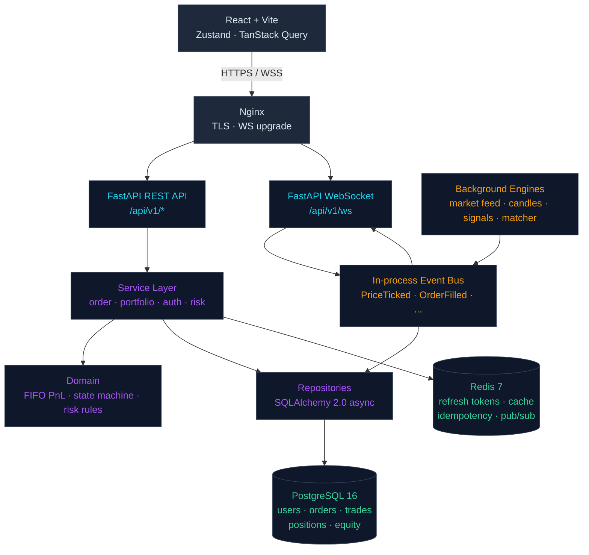

<div align="center">

# Algorithmic Trading Simulator

### *A production-grade quantitative trading platform — designed like fintech ships, documented like Anthropic ships.*

<br/>

[](./.github/workflows/ci-cd.yml)
[](https://www.python.org/)
[](https://fastapi.tiangolo.com/)
[](https://react.dev/)
[](https://www.postgresql.org/)
[](https://redis.io/)
[](./LICENSE)
[](https://docs.astral.sh/ruff/)

<br/>

**[Architecture](./ARCHITECTURE.md)** · **[Audit](./AUDIT.md)** · **[Roadmap](./ROADMAP.md)** · **[API Docs](http://localhost:8000/docs)** *(once running)*

<br/>

</div>

---

## The 30-second version

This is **not** another React-and-Express to-do app dressed up as a trading dashboard.

This is a full-stack **quantitative trading simulator** built on the same architectural principles you'd find at a real trading firm — a **five-layer backend**, an **async event bus**, **idempotent order execution**, **factor-driven signals**, **FIFO PnL accounting**, **refresh-token rotation in Redis**, and a frontend split between **Zustand** (client state) and **TanStack Query** (server state) with a **WebSocket → Query invalidation bridge**.

It ships with three documents totaling ~210 KB of engineering rationale: a forensic **audit** of the original codebase, a target **architecture** specification, and a phased **roadmap** with interview-defensible talking points for every commit.

> **Why does that matter?** Because anyone can stack technologies. Few people can defend the choices behind them. This project is built to be defended.

---

## Try it in 60 seconds

```bash
git clone https://github.com/No-Len-77/Algorithmic-Trading-Simulator.git
cd Algorithmic-Trading-Simulator
cp .env.example .env
docker compose up
```

Then visit:

| Surface | URL | What you'll see |
|---|---|---|
| **Trading dashboard** | <http://localhost:5173> | The actual app — register, log in, trade |
| **OpenAPI explorer** | <http://localhost:8000/docs> | Interactive Swagger UI for every endpoint |
| **Health probe** | <http://localhost:8000/health> | JSON status + DB connectivity |
| **pgAdmin** *(optional)* | <http://localhost:5050> | `docker compose --profile tools up` |
| **Redis Commander** *(optional)* | <http://localhost:8081> | Inspect refresh tokens + cache |

Register → log in → place a trade → watch your portfolio update live over WebSocket.

---

## The methodology — *audit first, code second*

```
┌─────────────┐       ┌──────────────┐       ┌───────────┐       ┌──────────────┐
│   AUDIT     │──────▶│ ARCHITECTURE │──────▶│  ROADMAP  │──────▶│ IMPLEMENTATION│
│  63 KB      │       │   81 KB      │       │   66 KB   │       │   phased      │
└─────────────┘       └──────────────┘       └───────────┘       └──────────────┘
   What's wrong         What we want            When + how        Ship & defend
   in the current        the target              we get there      every commit
   codebase              system to be
```

| Document | Size | What it contains |
|---|---|---|
| [`AUDIT.md`](./AUDIT.md) | 63 KB · 17 sections | Forensic teardown of the original codebase with **file:line references**, **severity ratings (P0/P1/P2/P3)** and a **top-25 punchlist**. |
| [`ARCHITECTURE.md`](./ARCHITECTURE.md) | 81 KB · 16 sections | The target system. **Folder layout**, **service boundaries**, **event flows**, **WebSocket protocol**, **trade-flow sequence diagram**, **ADR discipline**. |
| [`ROADMAP.md`](./ROADMAP.md) | 66 KB · 13 phases | The execution plan. **Ordered tasks**, **acceptance criteria**, **duration estimates**, and — most importantly — **interview talking points** for every phase. |

This is the discipline that separates a portfolio project from a defensible engineering artifact.

---

## Architecture at a glance



The full sequence diagram for one complete trade — browser POST → idempotency check → UoW transaction → event emit → WebSocket fan-out → TanStack Query invalidation — lives in [ARCHITECTURE.md §12](./ARCHITECTURE.md).

---

## Tech stack

<table>
<tr>
<td valign="top" width="33%">

### Backend

- **FastAPI** + Uvicorn (async ASGI)
- **SQLAlchemy 2.0** (async) + Alembic
- **PostgreSQL 16** primary store
- **Redis 7** cache · pub/sub · idempotency
- **PyJWT** + **bcrypt** (no passlib)
- **Pydantic v2** for validation
- **loguru** structured logging
- **prometheus-client** *(Phase 3.3)*

</td>
<td valign="top" width="33%">

### Frontend

- **React 19** + **Vite 7**
- **TailwindCSS 3** + design tokens
- **Zustand 5** — client state
- **TanStack Query 5** — server state
- **lightweight-charts** — candles
- **Recharts** — analytics
- **react-hot-toast** — notifications
- **Framer Motion** — micro-interactions

</td>
<td valign="top" width="33%">

### Infra & Tooling

- **Docker** multi-stage builds
- **docker-compose** dev topology
- **GitHub Actions** CI
- **Ruff** lint + format
- **mypy** type checking
- **pytest** + pytest-asyncio
- **Vitest** *(Phase 2.7)*
- **uv** for hashed lockfiles

</td>
</tr>
</table>

---

## Engineering highlights

The things you can put on a slide. These are the choices I made and can defend.

### Money is `Decimal`, time is `int`, IDs are `ULID`
Float arithmetic on currency is an interview disqualifier. All monetary values are `Decimal` end-to-end with explicit quantization at the API boundary. Times are epoch seconds (or ISO-8601 strings at the wire). Domain IDs are ULIDs — sortable, URL-safe, no UUIDv4 randomness penalty.

### Tokens never touch localStorage
Access tokens live **in memory only** (Zustand store). Refresh tokens live in an **httpOnly, samesite=lax cookie scoped to `/api/v1/auth`** — unreachable from JavaScript, rotated on every refresh. WebSocket handshake uses a **separate 60-second JWT** so reverse-proxy access logs never contain a long-lived token. *Audit fix [3.1, 3.11, 6.8].*

### Idempotent mutations
Every POST/PUT/PATCH/DELETE carries an `X-Idempotency-Key` (UUID). The server hits Redis first — same key + same body → cached response, **same key + different body → 409**, new key → execute. Replay-on-network-error is safe by construction. *Architecture §1.6.*

### FIFO over weighted-average cost basis
Realized PnL uses **FIFO lot matching**, not WAC. This is the correct choice for any system that might one day need a tax audit. The matcher is a pure function in `app/domain/pnl/fifo.py` — 30 lines, property-tested. *ADR-0002.*

### In-process event bus, not Kafka (yet)
Engines emit domain events (`PriceTicked`, `OrderFilled`, `SignalGenerated`, etc.). Subscribers — the WebSocket pusher, the audit logger, the equity-snapshot writer — consume from a single bus. **Kafka is deliberately out of scope for Phase 2/3** because the system has one process. The seam is built so swapping to Redis pub/sub (Phase 4) or Kafka (Phase 5) is a one-line change. *Architecture §5.7, ADR-0004.*

### `git rm` the dead code
The original codebase had ~1,900 lines of commented-out previous-generation code. **All deleted.** Three stacked versions of `routes.py`, two competing `PnLEngine` implementations, four iterations of the market-data engine. Phase 2.0 was a single PR titled "kill the commented code" before any new work began. *Audit §3.3, §12.6.*

---

## Current status

The roadmap is 13 phases over ~38 working days. Honest progress:

| Phase | Name | Status | What landed |
|---|---|---|---|
| **1.0** | Forensic audit | ✅ done | 17-section AUDIT.md, 25-item punchlist |
| **2.0** | Hygiene sweep | ✅ done | Dead code purged, `pyproject.toml`, `.dockerignore`, multi-stage Dockerfile, ruff CI |
| **2.1** | Auth hardening | ✅ done | PyJWT + bcrypt, refresh rotation, Zustand authStore, silent refresh, single-flight 401 retry |
| **2.2** | Database truth | ✅ done | Async SQLAlchemy 2.0, model/migration reconciled, new `orders` + `idempotency_records` tables, async conftest |
| **2.3** | Service & repository layers | 🚧 next | Strangler-fig the legacy router into `app/api/v1/*`, UnitOfWork pattern, typed repos |
| **2.4** | PnL & execution correctness | 📋 planned | FIFO PnL service, Decimal money, idempotent order placement, structured risk assessments |
| **2.5** | Real-time pipeline v1 | 📋 planned | Event bus, topic-based WS, EngineSupervisor, candle flicker fix |
| **2.6** | Frontend foundations | 📋 planned | Feature-folder reorg, TanStack Query for all server state, incremental chart updates |
| **2.7** | Test foundations + green CI | 📋 planned | Real test pyramid, k6 WS load test |
| **3.0** | Premium UI system | 📋 planned | Tokenized design system, micro-interactions, full page redesign |
| **3.1** | Trading terminal v1 | 📋 planned | All 4 order types, simulated book, recent-trades tape |
| **3.2** | WS protocol v2 + order matcher | 📋 planned | Sequence numbers, replay-on-reconnect, STOP/STOP-LIMIT fills |
| **3.3** | Observability + deploy | 📋 planned | Prometheus, Sentry, Fly.io deploy with public demo URL |
| **4.0** | Quant differentiation | 📋 planned | Pick 2-3 of: regime detection (HMM), convex portfolio optimizer, VaR, ONNX ML, backtest harness |

**Status snapshot:** ~3 of the 13 phases complete + the entire documentation phase. The next ★★★ job-critical milestone is Phase 2.6 (Frontend Foundations) and 3.0 (Premium UI System).

---

## Feature surface

<table>
<tr>
<td valign="top" width="50%">

### ✅ Shipped (Phase 2.0–2.2)

- JWT auth (access + refresh-rotation + WS token)
- Reactive frontend auth (Zustand + silent refresh)
- Real-time market data over WebSocket
- 1m / 5m / 15m candle aggregation
- Factor-based signal engine (trend · mean-reversion · momentum · volatility)
- Portfolio + unrealized/realized PnL
- Equity history snapshots
- Pre-trade risk gate
- Async SQLAlchemy 2.0 backend
- Async conftest + pytest fixtures
- Multi-stage Docker · ruff CI

</td>
<td valign="top" width="50%">

### 🚧 Coming (Phase 2.3–4.0)

- Full order types (MARKET / LIMIT / STOP / STOP-LIMIT)
- Order state machine with idempotency
- Structured risk assessments with violations
- In-process event bus + topic-based WS
- Server-driven WS heartbeats + reconnect replay
- Premium dark UI with glassmorphism
- Mobile-responsive trading terminal
- Convex portfolio optimizer (CVXPY)
- HMM-based market regime detection
- Backtest harness sharing live execution code
- Prometheus + Grafana observability
- Public Fly.io demo with one-click trial

</td>
</tr>
</table>

---

## Project structure

<details>
<summary>📂 <b>Click to expand the full tree</b></summary>

```
Algorithmic-Trading-Simulator/
├── 📘 AUDIT.md                     # 63 KB · forensic audit of the original code
├── 📐 ARCHITECTURE.md              # 81 KB · target system design
├── 🗺  ROADMAP.md                   # 66 KB · phased implementation plan
├── 📜 README.md                    # you are here
├── 📄 LICENSE
├── 🐍 pyproject.toml               # hashed lockfile · ruff · mypy · pytest config
├── 🐳 Dockerfile                   # multi-stage: base · api · workers
├── 🧩 docker-compose.yml           # postgres · redis · api · frontend + tools profile
├── ⚙  Makefile                      # one-shot dev tasks
├── 🛠  scripts/cleanup_local.sh     # local cleanup + GitHub helper
│
├── 🧠 app/                         # FastAPI backend
│   ├── api/
│   │   ├── routes.py               # legacy aggregate router (Phase 2.3 strangler target)
│   │   └── v1/                     # per-domain v1 routers (canonical going forward)
│   │       ├── __init__.py         # aggregator
│   │       └── auth.py             # ✅ Phase 2.1: register · login · refresh · logout · ws-token · me
│   ├── auth/                       # jwt_handler · password · dependencies (sync + async)
│   ├── core/                       # config · database · logger
│   ├── domain/                     # 🚧 Phase 2.3+ — pure business logic
│   ├── engines/                    # 🚧 Phase 2.5 — supervised async background tasks
│   ├── execution/                  # execution_engine
│   ├── infra/                      # redis_client · (event_bus + ws coming)
│   ├── market/                     # market_data_engine · candle_engine · market_state
│   ├── ml/                         # predictor (Phase 4 rebuilds via ONNX)
│   ├── models/                     # SQLAlchemy ORM (User, Order, Trade, Position, ...)
│   ├── portfolio/                  # pnl_engine · equity_engine · snapshot_service
│   ├── quant/                      # signal_engine + factor library
│   ├── repositories/               # 🚧 Phase 2.3 — UnitOfWork + typed repos
│   ├── risk/                       # risk_engine · daily_loss_engine
│   ├── schemas/                    # Pydantic request/response models
│   ├── services/                   # ✅ auth_service (more in Phase 2.3)
│   └── websocket/                  # connection manager · market stream
│
├── 🎨 frontend/                    # React 19 + Vite 7 + Tailwind 3
│   ├── package.json
│   ├── src/
│   │   ├── main.jsx                # providers: BrowserRouter · QueryClient · Toaster
│   │   ├── App.jsx                 # reactive Protected/PublicOnlyRoute via Zustand
│   │   ├── store/authStore.js      # in-memory access token + persisted user
│   │   ├── lib/queryClient.js      # TanStack Query defaults
│   │   ├── hooks/                  # useAuth · useAuthHydration · useMarket
│   │   ├── services/               # apiClient · authService · websocket
│   │   ├── pages/                  # Login · Register · Dashboard · Portfolio · Trade · ...
│   │   └── components/             # layout · charts · trading · common
│
├── 🗃  alembic/                     # SQLAlchemy migrations
│   ├── env.py
│   └── versions/
│       └── 0001_baseline.py        # Phase 2.2 canonical schema (audit 3.2)
│
├── 🧪 tests/                       # async-ready pytest fixtures
└── 🤖 .github/workflows/ci-cd.yml  # cached pip + npm · ruff · pytest · docker build
```

</details>

---

## Run, lint, test, deploy

```bash
# ---- One-time setup ----
make setup                          # install backend + frontend + run migrations

# ---- Daily dev ----
make docker-up                      # full stack via docker compose
make frontend-dev                   # frontend only (assumes api running)
make lint                           # ruff check + format
make format                         # ruff write
make test                           # pytest
make test-cov                       # with coverage report

# ---- Database ----
make db-upgrade                     # alembic upgrade head
make db-migrate msg='add foo'       # autogenerate a new revision
make db-current                     # show current head

# ---- Production ----
make check-deploy                   # validate .env for production
```

---

## Performance budgets

These are the targets the system commits to. They're enforced in CI when applicable, asserted in load tests, and tracked as regression triggers.

| Surface | Target | How it's enforced |
|---|---|---|
| REST endpoint (non-aggregating) p95 | < 100 ms | Phase 2.7 pytest perf tests |
| `/portfolio` aggregating p95 | < 300 ms | Phase 2.4 (after async DB) |
| WebSocket broadcast p95 (server-side) | < 50 ms | Phase 2.5 + k6 load test |
| Frontend initial bundle (gzipped) | < 300 KB | Vite build output check |
| Frontend Lighthouse Performance | > 85 | Phase 3.0 |
| Per-client idle WS bandwidth | < 10 KB/min | Phase 2.5 acceptance criterion |

---

## Documentation map

| Document | Purpose |
|---|---|
| [`README.md`](./README.md) | This file. The one-page overview. |
| [`AUDIT.md`](./AUDIT.md) | What was wrong with the original codebase, with severity. |
| [`ARCHITECTURE.md`](./ARCHITECTURE.md) | The target system. Every choice has rationale. |
| [`ROADMAP.md`](./ROADMAP.md) | Phased execution plan. Interview talking points per phase. |
| `docs/adr/` *(Phase 2.3)* | One ADR per consequential decision. |
| `docs/WS_PROTOCOL.md` *(Phase 3.2)* | Versioned WebSocket protocol specification. |

---

## Frequently asked

<details>
<summary><b>Why didn't you just rewrite it from scratch?</b></summary>

Because the folder skeleton was right and the surface area was correct. Rewriting would have meant throwing away three months of correct decisions to fix six weeks of incorrect ones. The audit identified what was salvageable; the roadmap migrated it phase-by-phase, each phase independently mergeable, each commit ending with a runnable system. *See [ROADMAP §15](./ROADMAP.md).*

</details>

<details>
<summary><b>Why no Kafka?</b></summary>

Because the system is one process. An in-process asyncio event bus solves the actual problem and ships in 200 lines. Kafka solves a problem this codebase doesn't have yet — cross-process or cross-host event distribution. The architecture is designed so that swapping the in-process bus for Redis pub/sub (Phase 4) or Kafka (Phase 5 ceiling) is a one-line change. *See [ADR-0004](./ARCHITECTURE.md).*

</details>

<details>
<summary><b>Why no TypeScript?</b></summary>

Deliberate Phase 5 deferral. Migrating React 19 + Vite + Tailwind from JS to TS mid-project is its own can of worms — every component, every hook, every API client gets touched. The right move is to ship Phase 2.6 (Zustand + TanStack Query) and Phase 3.0 (premium UI) in JS first, then do a single clean TS migration in Phase 5 against a stable codebase. *See [ARCHITECTURE §16.4](./ARCHITECTURE.md).*

</details>

<details>
<summary><b>Why FIFO and not weighted-average cost basis?</b></summary>

Because in real markets, cost-basis methodology has tax implications and an auditor needs to see lot-level matching. FIFO is the correct choice for any system that might one day need a financial audit. The function is 30 lines, pure, and property-tested. *See [ADR-0002](./ARCHITECTURE.md).*

</details>

<details>
<summary><b>Is this actually connected to a broker?</b></summary>

No. This is a simulator — not regulated, not connected to live order flow, not designed for real money. The architecture is a faithful model of the *engineering patterns* you'd find at a trading firm. *See [ARCHITECTURE §16.1](./ARCHITECTURE.md).*

</details>

---

## License

[MIT](./LICENSE) — do what you want, attribution appreciated.

---

## Author

Built by **[@No-Len-77](https://github.com/No-Len-77)**.

This project is part of a deliberate effort to build engineering artifacts that survive senior-engineer code review. If you're hiring for **frontend**, **full-stack**, **fintech**, or **quant systems** roles — I'd love to talk.

<div align="center">
<br/>
<sub>
Built with rigor. Documented with discipline. Ready to be defended in interviews.
</sub>
<br/><br/>

⭐ **If you find the audit-first methodology useful, star the repo — it helps others find it.**

</div>
